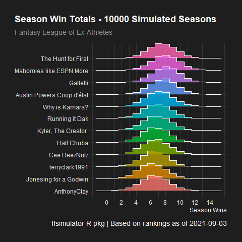

```{r setup, include=FALSE}
knitr::opts_chunk$set(echo = FALSE)

library(ffsimulator)
library(here)
setwd(here())
```

# How many wins could each team have?
```{r layout = "l-page"}



```

# How place will each team finish at?
```{r layout = "l-page"}

knitr::include_graphics("plots/rank_plot.png")

```

# How many points is each team expected to score?
```{r layout = "l-page"}

knitr::include_graphics("plots/points_plot.png")
```

